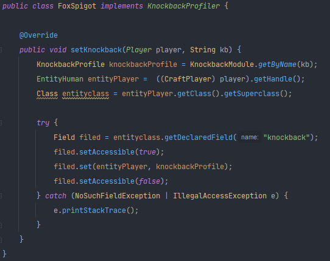
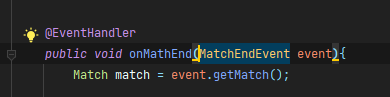
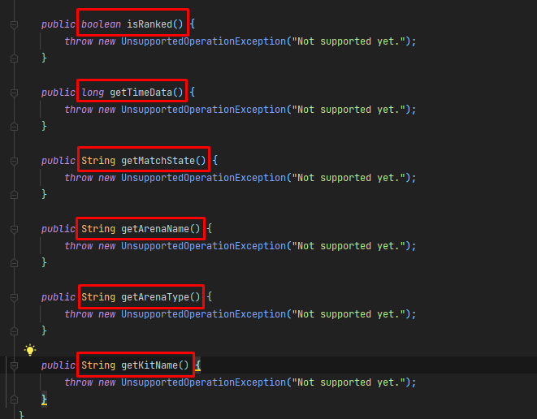
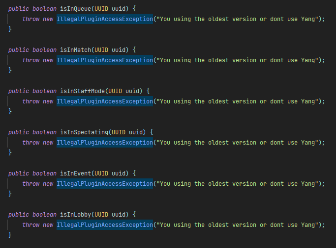

**YangAPI**

_¿How to create my private KnockbackProfiler from my private Spigot?_

- You have to create your own project in Intellij, Eclipse, etc.


- in plugin.yml put softdepend: Yang so that it loads yang first before the api, for example: 

    
  

- Create a room implementing KnockbackProfile
  ```Java
  import net.pandamc.yang.knockback.KnockbackProfiler;
  import org.bukkit.entity.Player;
  
  public class YourSpigotKnockback implements KnockbackProfiler {
  
      @Override
      public void setKnockback(Player player, String kb) {
      //Insert your code
      }
  
  }
  ```
  

- In the main class you have created, in the onEnable section register your KnockbackProfiler class 
  ```Java
      public class Main extends JavaPlugin {
  
      @Override
      public void onEnable() {
          YangAPI.setKnockbackProfile(new YourSpigotKnockback());
      }
  
      @Override
      public void onDisable() { }
    }
  ```
               
                       
 -
**How to usage the KnockbackProfiler?** 

- _I will leave you an example so you can understand how to use it_

    


**How to use the MatchCode?**

- _the only thing you have to know is the basics, know how to use a listener_

    

- _after that you can use the methods that are available which are the following_

    

**Player Methods**
    